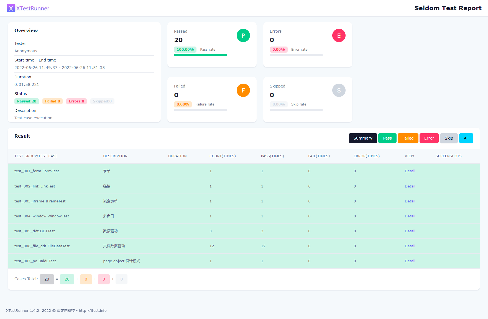

# seldom-web-testing

> seldom Web 自动化测试项目.

## 安装

```shell
> git clone https://github.com/SeldomQA/seldom-web-testing
> cd seldom-web-testing
> pip install -r requirements.txt
```

## 运行

目录结构：

```shell
mypro/
├── pages/
│   ├── xxx_page.py
├── reports/
├── test_data/
│   ├── xx_data.json
├── test_dir/
│   ├── test_xxx_xxx.py
└── run.py
```

* `pages/` page层封装目录。
* `reports/` 测试报告目录。
* `test_data/` 测试数据目录。
* `test_dir/` 测试用例目录。
* `run.py` 运行测试用例主文件。

运行用例：

```shell
# 指定测试目录
> seldom --path test_dir
# 指定文件（`/` 反斜杠）
> seldom --path test_dir/test_001_form.py

# 指定测试类
> seldom --mod test_dir.test_001_form.FormTest
# 指定测试方法
> seldom --mod test_dir.test_001_form.FormTest.test_from
```

## 测试报告


